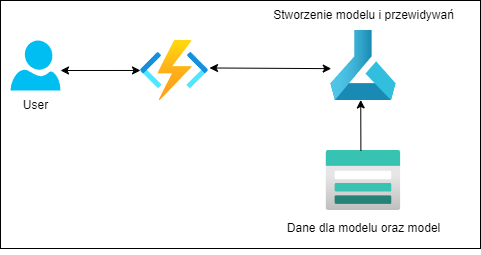

Projekt wykonywany w ramach przedmiotu "Azure and AI" prowadzonym na Politechnice Warszawskiej.

Cel projektu 
====
Celem projektu jest stworzenie aplikacji internetowej pomagającej lekarzom rozpoznawać choroby oczu (i nie tylko) na podstawie ich głębokich zdjęć. Narzędzie to miałoby być w formie strony internetowej, na której można zamieścić zdjęcie oka i w relatywnie któtkim czasie otrzymać raport o potencjalnych chorobach pacjenta.

Wykorzystane usługi oraz technologie
====
Azure Machine Learning \
Azure FileSystem \
Azure Functions\
Flask\
Jupyter notebook\
Pretrenowany model Inception3

Diagram architektury
====

Działanie
====
Pretrenowany model został wyuczony aby klasyfikować zestaw wielu chorób. Do trenowania modelu został wykorzystany zestaw danych zawierający sklasyfikowane zdjęcia prawego oraz lewego oka 5000 pacjentów.  
Oto lista chorób, które biorą udział w klasyfikacji:
+ Diabetes (D)
+ Glaucoma (G)
+ Cataract (C)
+ Age related Macular Degeneration (A)
+ Hypertension (H)
+ Pathological Myopia (M)
+ Other diseases/abnormalities (O)

Dostępna jest również etykiera (N) symbolizująca oko zdrowego pacjenta.  
Lekarz po wykonaniu zdjęcia oka pacjenta wchodzi na stronę i w sekcji przeznaczonej do wrzucania plików umieszcza zdjęcie pacjenta. Aplikacja Pythonowa napisana przy użyciu Flaska przyjmuje ten plik i wykonuje zapytanie do
modelu, który został już wyćwiczony, przy użyciu endpointu, który jest zapisany w KeyVault'cie. Aplikacja autoryzuje się i uzyskuje URI modelu. Następnie wysyła request z obrazem i oczekuje na predykcje. Kiedy model dokona predykcji są one zwracane i wyświetlane w czytelny sposób obrazując procentową predykcję występowania u pacjenta każdej z klasyfikowanych chorób. 

Demo
====
[Link do prezentacji działania programu]()

Wnioski
====
Stawianie prostej aplikacji webowej okazało się wielkim wyzwaniem, na które nie byliśmy gotowi. Brak laboratoriów nie pomógł nam przy próbach rozwiązania licznych problemów, na które trafiliśmy. Pierwszy problem, na który natrafiliśmy był związany z brakiem zależności w środowisku Pythonowym związanych z funkcjonalnością serwisu Azure. Były one niezbędne do połączenia aplikacji z KeyVaultem. Problem został rozwiązany po migracji projektu do GitHub'a i zaimplementowaniu **GitHub Actions**, które umożliwiły konfigurację środowiska przy deploy'u. W następnej kolejności, nie zdołaliśmy przekazać odpowiednich danych wymaganych do autentykacji. Aplikacja nie miała możliwości połączenia się z **KeyVault'em** i uzyskaniem potrzebnych informacji o adresie URI do modelu wymaganego do predykcji. Próby utworzenia **Managed identity**, które stanowią klucz do komunikacji aplikacji z serwisami trzymającymi klucze/sekrety/certyfikaty zakończyły się porażką, ponieważ **Azure AD** odmawia dostępu do wporwadzania jakichkolwiek zmian na naszych kontach. Stworzenie nowego AD również się nie powiodło. Postanowiliśmy zrezygnować z KeyVault'a na potrzeby dalszej realizacji zadania. Niestety, po tej zmianie aplikacja wciąż nie była responsywna, a logi kontenerów i aplikacji przedstawiały stare błędy i nie pozwalały na wykrycie przyczyny problemów. System logowania błędów na platforie Azure wymaga wielu usprawnień, aby mógł on być czytelny i rzeczywiście użyteczny. Ostatecznie musieliśmy zdecydować się na użycie innej infrastruktury, która umożliwiłaby nam zwykłe przetwarzanie rządań i zracanie predykcji. Idealnym rozwiązaniem wydawały się być **Azure Functions**. Okazało się, że mimo znajomości framework'a Flask, który byłby idealnym i prostym rozwiązaniem w przypadku aplikacji webowej, Functions cechowały się inną składnią i żadne z nas nie było w stanie prawidłowo skonfigurować tego serwisu. Również w fazie dostosowywania modelu predykcji doświadczyliśmy wielu niechcianych problemów związanych z uczeniem i deploy'em modelu. Niedoceniliśmy wyzwania i przeznaczyliśmy zbyt mało czasu oraz zasobów na satysfakcjonującą realizację tego projektu. Niemniej nauczyliśmy się wiele o rzeczywistym procesie tworzenia i deploy'owania apliakcji webowych i innych serwisów na platfomie Azure. Pozostaje liczyć, że projekt XL będzie owocniejszy i sprawi nam mniej problemów technicznych, z którymi nie będziemy mogli sobie poradzić. Oby była to doskonała okazja, aby dokonać rozeznania w aspektach serwisu Azure, które są kluczowe, a z którymi mamy największe problemy, aby efektywniej sobie z nimi radzić.

Skład zespołu
====
[Agnieszka Stefankowska](https://github.com/NeferHikari) \
[Hubert Mazur](https://github.com/JayHubPL) \
[Jakub Karpiński](https://github.com/Jakub-Kar) 

